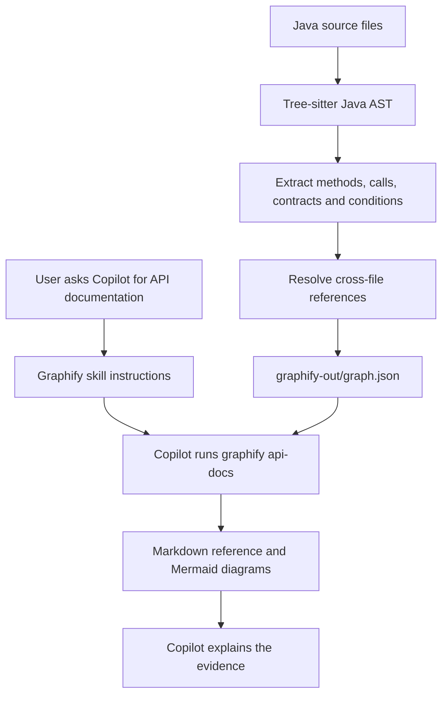

# Graphify Java API Documentation — Architecture and Demo Guide

This guide describes the implementation reviewed on `codex/java-api-docs-accuracy`, version **0.10.1**.

> Graphify reads Java source code and stores structured evidence in a graph. When someone requests API documentation, Graphify generates the reference from that graph, and Copilot invokes the tools and explains the results.

The important separation is **AST extraction → graph evidence → documentation → Copilot narration**.

## 1. Overall architecture



The recommended extraction and documentation commands do not need an LLM key. Copilot supplies the conversational layer; it does not generate the underlying AST facts.

## 2. How the graph is generated

Run this from the Java service's root folder:

```powershell
graphify extract . --no-cluster
```

### A. Discover and parse Java files

Graphify discovers eligible `.java` files and parses them with Tree-sitter's Java grammar. The syntax tree identifies structures such as:

- Classes, interfaces, methods and constructors.
- Fields, parameters and return types.
- Annotations and HTTP mappings.
- Method invocations.
- Conditional expressions, returns and throws.

This is structural parsing, not an LLM guessing what the code does.

### B. Extract facts and evidence

For a controller method, Graphify records information such as:

```text
HTTP endpoint: GET /v1/remote/addons/details
Handler: AddonController.getAddonDetailsByExternalIds
Parameters: names, declared types, recorded request annotations
Return type: ResponseEntity<List<AddonDetails>>
Source: file and line
```

For each call, it records available evidence including the caller, receiver, method name, arguments, location and surrounding conditions.

For example:

```java
if (request.isEnabled()) {
    paymentClient.charge(request);
}
```

The relevant fact is that `charge(request)` is called under the condition `request.isEnabled()`. It must not become “payment is always charged.”

Recorded conditions are source predicates. They are not proof of runtime feasibility or automatically verified business requirements.

### C. Resolve references across files

Parsing an invocation is different from identifying its target. For example:

```java
addonService.getAddonDetailsByExternalIds(...)
```

Graphify uses available declarations, imports, receiver types, method signatures and argument counts to identify possible targets.

Interface dispatch can connect:

```text
AddonService.getAddonDetailsByExternalIds()
    → AddonServiceImpl.getAddonDetailsByExternalIds()
```

That dispatch is inferred static evidence, not proof of which Spring bean executes at runtime.

Where resolution is insufficient, the call should remain an unresolved gap rather than disappearing or receiving an invented target. Same-named methods or types do not automatically mean the same graph entity; source identity and resolution context matter.

### D. Persist the graph

The result is saved in `graphify-out/graph.json`.

| Graph component | Contents |
| --- | --- |
| Nodes | Files, types, methods and other extracted entities |
| Edges | Calls, references, imports and other relationships |
| Metadata | Contracts, conditions, outcomes, locations and diagnostics |
| Evidence classification | Extracted, inferred or unresolved information |

The graph is a snapshot. When source changes, it must be refreshed.

This is not a Java compiler, a full symbolic execution engine or runtime tracing. Reflection, generated implementations, external libraries and runtime dependency injection can leave gaps.

## 3. How Copilot is instructed to use the graph

The integration consists of a skill instruction file plus the local Graphify CLI.

For Copilot CLI, run:

```powershell
graphify copilot install
```

This installs the Graphify skill and supporting references under:

```text
%USERPROFILE%\.copilot\skills\graphify\
```

For the VS Code integration, use:

```powershell
graphify vscode install
```

The repository's skill explicitly instructs the agent to:

- Locate the requested repository's `graphify-out/graph.json`.
- Use Graphify commands instead of reading the entire potentially huge JSON file.
- Use `graphify api-docs` for reviewable API documentation.
- Preserve downstream branches and distinguish inferred and unresolved evidence.
- Report missing evidence instead of inventing behavior.
- Inspect source when explicitly asked for an accuracy audit or debugging, while distinguishing source findings from saved graph evidence.

### What the short prompt does

In Copilot, ask:

```text
/graphify generate API documentation for GET /v1/remote/addons/details
```

Copilot interprets that natural-language request using the skill and should invoke a command equivalent to:

```powershell
graphify api-docs --graph graphify-out/graph.json --endpoint "GET /v1/remote/addons/details" --output api-docs
```

Important distinctions:

1. `api-docs` is a CLI command, not a separate skill. The Graphify skill tells Copilot to invoke it.
2. Copilot interprets the natural-language request; the CLI itself accepts the explicit `api-docs` command and its arguments.
3. The skill is guidance, not a security restriction. It does not technically prevent Copilot from reading Java files.
4. The `api-docs` generator itself reads the saved graph without reopening Java source.
5. If several graphs could answer the request, the agent should clarify the intended scope rather than silently choosing one.

During the demo, show Copilot's tool activity so the audience can see which command it actually runs.

## 4. How API documentation is generated

The generator:

1. Loads the saved graph.
2. Finds the inbound HTTP endpoint matching the requested verb and path.
3. Identifies its controller method.
4. Traverses recorded call relationships and graph-derived interface dispatches.
5. Collects method contracts, conditions, outcomes and unresolved calls.
6. Writes Markdown and Mermaid diagrams.

It tracks visited nodes to avoid infinite expansion through recursion while retaining the recorded relationships. A static call inventory is not a guaranteed execution sequence or proof of concurrency.

The reference includes:

- Endpoint and handler.
- Recorded request parameters and response types.
- Available DTO field evidence.
- Downstream method-call diagrams.
- Call arguments, conditions and source locations.
- Recorded return and exception outcomes.
- Unresolved calls and extraction diagnostics.
- The input graph's SHA-256 for traceability.

There is no default output budget. Copilot's own context limits still exist; removing Graphify's caps cannot remove the agent's limits.

A single-service graph cannot reveal another service's internal implementation unless that evidence is present. It can document an outbound call and explicitly show where visibility ends. Merging is optional and is not required for the single-service documentation workflow.

## 5. Where this lives in code

| File | Responsibility |
| --- | --- |
| [extract.py](../graphify/extract.py) | Java extraction orchestration, cross-file resolution, unresolved-call handling and graph assembly |
| [engine.py](../graphify/extractors/engine.py) | AST traversal, invocation evidence, conditions and method contracts |
| [api_docs.py](../graphify/api_docs.py) | Endpoint selection, graph traversal, Markdown and Mermaid generation |
| [skill-copilot.md](../graphify/skill-copilot.md) | Instructions Copilot follows |
| [install.py](../graphify/install.py) | Installation of agent instructions and references |

Key functions for a technical walkthrough:

- `extract()`: assembles Java extraction results and applies resolution passes.
- `_java_call_conditions()`: captures syntactic conditions associated with calls.
- `_java_method_contract_metadata()`: extracts method contract metadata.
- `endpoint_catalog()`: selects production inbound HTTP endpoints from graph metadata.
- `evidence()`: traverses the graph for endpoint call evidence.
- `generate()`: loads the graph, selects endpoints and writes the reference documents.

## 6. Demo workflow

Run these commands from the Java service's root folder, using the installed package from the `codex/java-api-docs-accuracy` branch.

### Step 1: Check the installed version and refresh the skill

```powershell
graphify --version
graphify copilot install
```

The version reviewed for this guide is 0.10.1. Start a fresh Copilot session after refreshing its instructions. Use `graphify vscode install` instead for the VS Code integration.

### Step 2: Generate the graph

```powershell
graphify extract . --no-cluster
```

For an intentional full replacement of an existing graph:

```powershell
graphify extract . --no-cluster --force
```

After ordinary source changes:

```powershell
graphify update .
```

After an extractor upgrade, use a full re-extraction when you need newly supported evidence. Removing output budgets alone does not require rebuilding the graph.

### Step 3: Ask Copilot

```text
/graphify generate API documentation for GET /v1/remote/addons/details
```

No long prompt, audience flag or budget is necessary. Copilot can adapt its explanation to the question without a developer/BSA mode.

### Step 4: Show the generated document

The default output directory is `api-docs`, containing an `index.md` and endpoint-specific Markdown files. Endpoint filenames include a route-derived slug and a hash suffix.

Show these four things during the demo:

1. Request and response contract.
2. Mermaid call diagram in a Markdown viewer that supports Mermaid.
3. Conditions and success/error evidence.
4. Explicit unresolved gaps.

A predictable CLI fallback is:

```powershell
graphify api-docs --endpoint "GET /v1/remote/addons/details" --strict
```

`--strict` rejects recorded extraction/parse errors. It does not certify that every call is resolved. Add `--force` only when intentionally replacing previously generated documents, or choose a different `--output` directory.

## 7. How to test that it works

### Test A: Verify accuracy against one known API

Choose an API whose implementation you understand. Compare the generated document against the source:

| Check | What to verify |
| --- | --- |
| Endpoint | Correct HTTP verb, route and controller |
| Contract | Correct parameter and response types |
| Calls | Each expected downstream call is represented or explicitly unresolved |
| Conditions | Correct predicate attached to the relevant call or outcome |
| Outcomes | Returns and exceptions reflect recorded code, not invented HTTP mappings |
| Boundaries | External or unresolved behavior is clearly identified |

This is an accuracy audit, so reading source is appropriate. Check both missing real calls and incorrectly resolved extra calls; a larger graph is not necessarily a more accurate graph.

### Test B: Prove documentation uses the graph

Copy only `graphify-out/graph.json` into a fresh folder, preserving that directory structure. Do not copy Java source. Keep the original repository unchanged.

From the fresh folder, run:

```powershell
graphify api-docs --endpoint "GET /v1/remote/addons/details"
```

If the document is generated, you have demonstrated that the documentation generator needs the graph, not the original Java files. This does not prove Copilot is sandboxed away from source files elsewhere on the machine.

### Test C: Verify Copilot's behavior

In a fresh Copilot session:

- Give the short documentation prompt.
- Inspect its tool calls.
- Confirm it invokes `graphify api-docs` against the intended graph.
- Compare its explanation with the generated reference.
- Check that it does not silently omit downstream branches or turn conditional behavior into unconditional claims.

### Recorded regression validation

The last recorded 0.10.1 release validation was **1,825 passed and 17 skipped tests**. Lint, package build and skill validation also passed. Optional MCP HTTP runtime tests were skipped because the dependency was unavailable in that environment.

These are historical regression results, not a newly executed validation for this guide and not an enterprise accuracy percentage. Your actual service still needs the source comparison above. See [VALIDATION.md](VALIDATION.md) and [ACCURACY.md](ACCURACY.md).

## 8. Questions to be ready for

| Question | Answer |
| --- | --- |
| Does an LLM generate the graph? | Not in the recommended `extract --no-cluster` workflow. Java syntax extraction and resolution produce the evidence. |
| Why use Copilot at all? | It turns a natural-language request into tool invocations and can explain the generated evidence for the audience. The reference generator works without Copilot. |
| Does Copilot have to reread Java? | The documentation generator does not. The skill directs Copilot to graph evidence, but it is not an access-control mechanism. |
| Is this 100% accurate? | No. Static analysis has resolution limits. Extracted, inferred and unresolved evidence must remain distinguishable. |
| Are conditions business rules? | They are recorded source predicates. Business interpretation requires context and review. |
| Does the diagram show exact runtime order? | No. It shows static call relationships and recorded conditions, not an execution trace. |
| What happens at an unresolved call? | It is a visibility gap, not proof that the application stops there. |
| Can it document another service's internals? | Only when those internals are represented in the input graph. An outbound call alone is insufficient. |
| Why include a graph hash? | It identifies the exact graph bytes used to generate the document. It does not independently prove source freshness. |
| How do we keep documents current? | Refresh the graph after source changes, then regenerate the documents. |
| Are there output budgets? | No default Graphify query/document output budget. Explicit caps remain available where supported, and Copilot retains its own context limits. |

## 9. Suggested presentation summary

> We have separated deterministic code evidence from AI explanation. Tree-sitter extracts Java structure, and our resolver connects available method references while retaining conditions, contracts and unresolved gaps. We persist that evidence in a graph. Copilot's Graphify skill invokes a graph-only documentation generator, which produces a traceable Markdown reference with Mermaid diagrams. Copilot can then explain it for the audience. We do not claim runtime or 100% accuracy; uncertainty remains visible and reviewable.

## Further reading

- [Project README](../README.md)
- [Detailed technical guide](TECHNICAL_GUIDE.md)
- [Accuracy review guide](ACCURACY.md)
- [Validation record](VALIDATION.md)
- [Generated example API reference](example-api/index.md)
