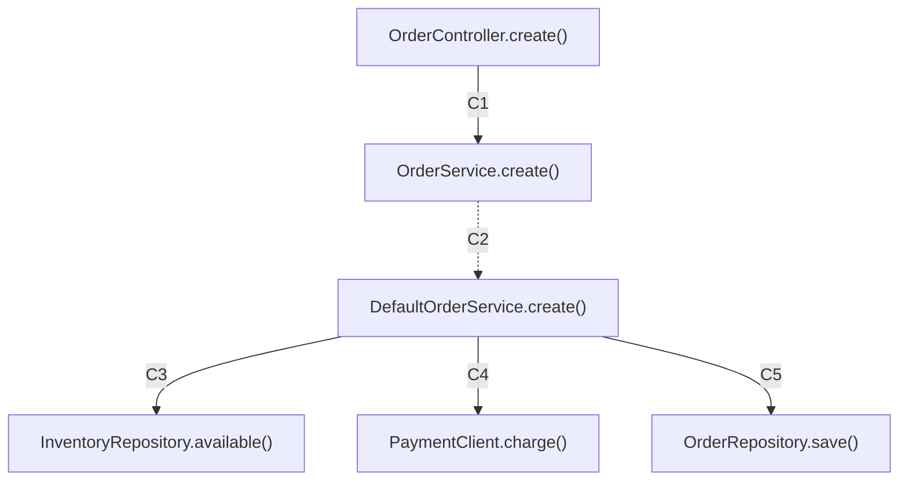

# POST /orders

## Document control

| Property | Evidence |
| --- | --- |
| Service | Single-service graph |
| Handler | OrderController.create() |
| Source | src/main/java/example/OrderController.java:L11 |
| Graph SHA-256 | 7004061cd97c02ef22b6f72159ba683c467bf7f4712d2705fe08add13cd05c79 |
| Document schema | java-api-docs/1 |
| Status | Generated static reference — review unresolved boundaries before approval |

## Scope and reading guide

This document records what the Java graph contains. Diagrams show possible calls, not a runtime sequence. All conditional alternatives are retained. EXTRACTED means a syntactic/declared-type binding; INFERRED dispatch is a possible implementation. A missing edge does not establish that a network call or behavior is absent.

Sections: [Request](#request-contract), [Response](#response-contract), [Flow](#api-flow-diagram), [Calls](#call-evidence), [Logic](#conditions-and-outcomes), [Gaps](#boundaries-and-quality).

## Request contract

| Input | Binding | Java type | Required | Validation / default |
| --- | --- | --- | --- | --- |
| request | body | OrderRequest | unspecified | {"validated": false} |

## Response contract

Declared return: <code>ResponseEntity&lt;OrderResponse&gt;</code>.

HTTP statuses and return expressions appear below only when recorded. No example payload or error-to-status mapping is invented.

### Recorded request/response fields

| Type | Field | Declared type | Type declaration |
| --- | --- | --- | --- |
| OrderRequest | customerId | String | src/main/java/example/OrderRequest.java:L3 |
| OrderRequest | sku | String | src/main/java/example/OrderRequest.java:L3 |
| OrderRequest | quantity | int | src/main/java/example/OrderRequest.java:L3 |
| OrderResponse | orderId | String | src/main/java/example/OrderResponse.java:L3 |
| OrderResponse | paymentId | String | src/main/java/example/OrderResponse.java:L3 |

## API flow diagram

Solid arrows are extracted bindings; dotted arrows are inferred. C-numbers link to the evidence table. Large flows are split without dropping edges.

## Call evidence

| ID | Caller | Target | Evidence | Guard | Arguments | Call site |
| --- | --- | --- | --- | --- | --- | --- |
| C1 | OrderController.create() | OrderService.create() | EXTRACTED / calls | guard [after_guard]: request == null &#124;&#124; request.quantity &lt;= 0 (earlier exit predicate false) | request | src/main/java/example/OrderController.java:L16:34 |
| C2 | OrderService.create() | DefaultOrderService.create() | INFERRED / dispatches_to | No enclosing predicate recorded |  | src/main/java/example/DefaultOrderService.java:L8 |
| C3 | DefaultOrderService.create() | InventoryRepository.available() | EXTRACTED / calls | No enclosing predicate recorded | request.sku, request.quantity | src/main/java/example/DefaultOrderService.java:L9:14 |
| C4 | DefaultOrderService.create() | PaymentClient.charge() | EXTRACTED / calls | guard [after_guard]: !inventory.available(request.sku, request.quantity) (earlier exit predicate false) | request.customerId, request.quantity | src/main/java/example/DefaultOrderService.java:L12:28 |
| C5 | DefaultOrderService.create() | OrderRepository.save() | EXTRACTED / calls | guard [after_guard]: !inventory.available(request.sku, request.quantity) (earlier exit predicate false); guard [after_guard]: paymentId == null (earlier exit predicate false) | request, paymentId | src/main/java/example/DefaultOrderService.java:L16:16 |

## Method contracts

| Method | Parameters | Return | Declaration |
| --- | --- | --- | --- |
| OrderController.create() | OrderRequest request | ResponseEntity&lt;OrderResponse&gt; | src/main/java/example/OrderController.java:L11 |
| OrderService.create() | OrderRequest request | OrderResponse | src/main/java/example/OrderService.java:L4 |
| DefaultOrderService.create() | OrderRequest request | OrderResponse | src/main/java/example/DefaultOrderService.java:L8 |
| InventoryRepository.available() | String sku, int quantity | boolean | src/main/java/example/InventoryRepository.java:L4 |
| PaymentClient.charge() | String customerId, int quantity | String | src/main/java/example/PaymentClient.java:L4 |
| OrderRepository.save() | OrderRequest request, String paymentId | OrderResponse | src/main/java/example/OrderRepository.java:L4 |

## Conditions and outcomes

| Method | Kind | Expression | Enclosing guard | Line |
| --- | --- | --- | --- | --- |
| OrderController.create() | if | request == null &#124;&#124; request.quantity &lt;= 0 | No enclosing predicate recorded | L13 |
| OrderController.create() | ternary | response == null | No enclosing predicate recorded | L17 |
| OrderController.create() | return | ResponseEntity.badRequest().build() | if [then]: request == null &#124;&#124; request.quantity &lt;= 0 (predicate true) | L14 |
| OrderController.create() | return | ResponseEntity.notFound().build() | guard [after_guard]: request == null &#124;&#124; request.quantity &lt;= 0 (earlier exit predicate false); ternary [then]: response == null (predicate true) | L17 |
| OrderController.create() | return | ResponseEntity.ok(response) | guard [after_guard]: request == null &#124;&#124; request.quantity &lt;= 0 (earlier exit predicate false); ternary [else]: response == null (predicate false / default) | L17 |
| DefaultOrderService.create() | if | !inventory.available(request.sku, request.quantity) | No enclosing predicate recorded | L9 |
| DefaultOrderService.create() | if | paymentId == null | No enclosing predicate recorded | L13 |
| DefaultOrderService.create() | return | null | if [then]: !inventory.available(request.sku, request.quantity) (predicate true) | L10 |
| DefaultOrderService.create() | throw | new IllegalStateException("Payment was declined") | guard [after_guard]: !inventory.available(request.sku, request.quantity) (earlier exit predicate false); if [then]: paymentId == null (predicate true) | L14 |
| DefaultOrderService.create() | return | orders.save(request, paymentId) | guard [after_guard]: !inventory.available(request.sku, request.quantity) (earlier exit predicate false); guard [after_guard]: paymentId == null (earlier exit predicate false) | L16 |

## Boundaries and quality

| Caller | Unresolved invocation | Guard | Line |
| --- | --- | --- | --- |
| OrderController.create() | ResponseEntity.build | if [then]: request == null &#124;&#124; request.quantity &lt;= 0 (predicate true) | L14 |
| OrderController.create() | ResponseEntity.badRequest | if [then]: request == null &#124;&#124; request.quantity &lt;= 0 (predicate true) | L14 |
| OrderController.create() | ResponseEntity.build | guard [after_guard]: request == null &#124;&#124; request.quantity &lt;= 0 (earlier exit predicate false); ternary [then]: response == null (predicate true) | L17 |
| OrderController.create() | ResponseEntity.notFound | guard [after_guard]: request == null &#124;&#124; request.quantity &lt;= 0 (earlier exit predicate false); ternary [then]: response == null (predicate true) | L17 |
| OrderController.create() | ResponseEntity.ok | guard [after_guard]: request == null &#124;&#124; request.quantity &lt;= 0 (earlier exit predicate false); ternary [else]: response == null (predicate false / default) | L17 |
| DefaultOrderService.create() | .IllegalStateException | guard [after_guard]: !inventory.available(request.sku, request.quantity) (earlier exit predicate false); if [then]: paymentId == null (predicate true) | L14 |

- Reachable symbols: 6; directed call edges: 5; unresolved call sites: 6.
- Syntax diagnostics in this graph: 0.
- Reflection, dependency binaries, generated methods, Spring bean selection, exception advice, authorization and runtime configuration may need source/runtime verification.
- No runtime latency, data values or complete business semantics are asserted.
